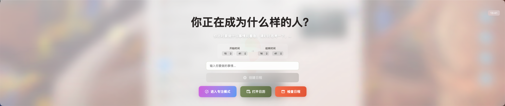

# AlwaysHaveAPlan

> A minimalist macOS app that keeps you intentional — every time you unlock your screen.

[中文](#中文) | [English](#english)

---

## 中文

### 这是什么？

**AlwaysHaveAPlan** 是一款 macOS 专注工具。它在两个场景下默默守护你的注意力：

1. **解锁屏幕时** — 浮窗弹出，提醒你当前日历事项或用一个深刻的问题唤醒自我觉察
2. **进入专注模式时** — 沉浸式全屏书写空间，搭配粒子动效背景，帮你深度投入单一任务

---

### 为什么要做 Obsidian 联动？

我在 Obsidian 里维护着一套日记系统：按年 → 月 → 日归档，每天的日记格式固定，其中有一栏叫**「今日记录」**，用来沉淀每段专注时间里写下的东西。

**问题**：我几乎不会主动打开 Obsidian 去写日记。

**解法**：让日记内容主动找上我。

AlwaysHaveAPlan 的专注模式就是这个解法的核心——

1. **强制弹出，降低门槛**  
   每次进入专注模式时，系统弹出一个全屏书写空间。标题就是你当前在做的事，文本框就是你这段时间的思考记录。不需要主动打开 Obsidian，不需要找文件夹，直接写就好。

2. **自动归档到 Obsidian 日记**  
   关闭专注窗口后，这段内容会自动写入当天的 Obsidian 日记文件（本地 Markdown）。Obsidian 的 vault 本质是本地文件系统，可以直接读写，无需插件。

3. **碎片积累，回溯有迹可循**  
   每次打开 Obsidian，过去每段专注时间写下的东西都完整保存在那里。写作习惯不再依赖意志力，而是系统的副产品。

> 这个设计的本质是：**把「写日记」这件事，从一个需要主动触发的任务，变成专注工作的自然结果。**

---

### 截图预览

**浮窗提示 — 解锁时自动弹出**



**专注模式 — 沉浸式书写空间**


---

### 核心功能

| 功能 | 说明 |
|------|------|
| 🔓 解锁触发 | 解锁或唤醒 Mac 时自动弹出提醒 |
| 📅 日历集成 | 读取系统日历，实时显示当前事项和进度 |
| 🎯 专注模式 | 全屏沉浸书写空间，番茄计时器内置 |
| ❄️ 粒子背景 | 雪/雨粒子动效，可调密度与速度 |
| 🌫️ 毛玻璃卡片 | 卡片透明度、边框、背景模糊均可实时调节 |
| ⌨️ 全局热键 | `Control+Shift+Command+O/F` 随时唤起，无需切换应用 |
| 🔊 环境音效 | 内置环境音量控制，专注时减少干扰 |

---

### 使用方式

**解锁提示**
- 锁屏（`Control+Command+Q`）后解锁，浮窗自动弹出
- 有日历事项时显示当前进度，无事项时显示觉察提问

**专注模式**
- 全局热键 `Control+Shift+Command+F` 直接进入
- 或在浮窗点击进入专注
- 底部控制条 hover 后调节粒子/清晰度/玻璃感/音量
- 左上角字体面板随时切换字型和字号

---

### 安装

#### 从源码构建

```sh
git clone https://github.com/tang730125633/alwayshaveaplan.git
cd alwayshaveaplan

# 构建 release 版
./build-release.sh

# 复制到应用目录
cp -r run/release/AlwaysHaveAPlan.app /Applications/
```

#### 开发模式

```sh
swift run
```

**系统要求**：macOS 14.0+，需授予日历访问权限

---

### 技术栈

- **Swift + SwiftUI** — macOS 原生开发
- **Carbon API** — 系统级全局热键注册
- **EventKit** — 系统日历集成
- **NSVisualEffectView** — 原生毛玻璃效果
- **TimelineView + Canvas** — 粒子动效驱动
- **DistributedNotificationCenter** — 解锁事件监听

---

### 更新日志

**v1.2.0** (2026-05-05)
- ⌨️ 全局热键支持（`Control+Shift+Command+O/F`），无需聚焦应用
- ❄️ 粒子尺寸和速度大幅提升，视觉更有张力
- 🌫️ 背景清晰度控制重做（滑到最右 = 最清晰）
- 💎 毛玻璃卡片边框加强，极低透明度时保留可见边界和淡灰底
- 🎛️ 底部控制条 hover 逻辑修复，只在鼠标靠近时浮现

**v1.1.0** (2026-02)
- 添加专注模式全屏书写空间
- 番茄计时器、字体选择器、环境音效

**v1.0.0**
- 解锁触发 + 日历集成 + 毛玻璃浮窗

---

### 致谢

基于 [ChrisZou/alwayshaveaplan](https://github.com/ChrisZou/alwayshaveaplan) 进行大幅扩展与重设计。感谢原作者提供的基础框架。

---

### License

[MIT](LICENSE)

---

## English

### What is this?

**AlwaysHaveAPlan** is a minimalist macOS focus tool. It shows up in two moments:

1. **On screen unlock** — A floating overlay reminds you of your current calendar event or asks a grounding question when you have nothing scheduled
2. **In Focus Mode** — A full-screen immersive writing space with animated particle backgrounds, helping you go deep on one thing

---

### Why Obsidian Integration?

I keep a daily journal in Obsidian — organized by year → month → day, with a fixed template for each entry. One section is called **"Focus Log"**, where I capture thoughts from each focused work session.

**The problem**: I almost never open Obsidian voluntarily to write.

**The solution**: Make the journal come to me.

That's what Focus Mode is built around:

1. **Forced prompt, zero friction**  
   Every time you enter Focus Mode, a full-screen writing space appears. The title is whatever task you set, and the text area is where your thoughts go. No need to navigate to a file — just write.

2. **Auto-saved to your Obsidian daily note**  
   When you close the session, the content is automatically written into that day's Obsidian journal file (plain Markdown on disk). Obsidian's vault is just a local folder — no plugin required, just direct file I/O.

3. **Compounding record, effortless review**  
   Every time you open Obsidian, every focused session you've had is already there. The journaling habit stops depending on willpower and becomes a natural byproduct of doing focused work.

> The core idea: **turn "writing a journal" from a task you have to remember, into something that just happens when you work.**

---

### Screenshots

**Floating Prompt — appears on unlock**


**Focus Mode — immersive writing space**


---

### Features

| Feature | Description |
|---------|-------------|
| 🔓 Unlock Trigger | Auto-shows on screen unlock or wake |
| 📅 Calendar Integration | Reads system calendar, shows live event progress |
| 🎯 Focus Mode | Full-screen writing space with Pomodoro timer |
| ❄️ Particle Background | Snow/rain particles with adjustable density |
| 🌫️ Glass Card | Real-time opacity, border, and blur controls |
| ⌨️ Global Hotkeys | `Control+Shift+Cmd+O/F` work system-wide |
| 🔊 Ambient Audio | Built-in volume control for focus sessions |

---

### Installation

#### Build from source

```sh
git clone https://github.com/tang730125633/alwayshaveaplan.git
cd alwayshaveaplan
./build-release.sh
cp -r run/release/AlwaysHaveAPlan.app /Applications/
```

**Requirements**: macOS 14.0+, Calendar permission required

---

### Tech Stack

- **Swift + SwiftUI** — Native macOS app
- **Carbon API** — System-level global hotkeys
- **EventKit** — Calendar integration
- **NSVisualEffectView** — Native frosted glass
- **TimelineView + Canvas** — Particle animation engine

---

### Credits

Built on top of [ChrisZou/alwayshaveaplan](https://github.com/ChrisZou/alwayshaveaplan). Thanks to the original author for the solid foundation.

---

### License

[MIT](LICENSE)


---

## 中文

### 🎯 这是什么？

一个帮助你保持专注的 macOS 应用。每次解锁 Mac 时，它会：
- 📅 **有日程时**：显示当前正在进行的事项和进度
- 💭 **无日程时**：用一个深刻的问题唤醒你的自我觉察

### ✨ 本版本的特色改进

相比原版，这个版本做了以下优化：

#### 🌫️ **macOS 原生毛玻璃效果**
- 使用 `NSVisualEffectView` 实现真正的系统级毛玻璃模糊
- 背景透过桌面，更有沉浸感和现代感
- 事件卡片采用半透明玻璃质感，层次分明

#### 💪 **更有力量的激励文案**
- 原版："你想干什么？"
- **新版**："**你正在成为什么样的人？**"
- 副标题强调深度思考："你此时要做什么事情别着急，请好好思考一下，当下最重要的事情是什么？"
- 更符合 Dan Koe 人生操作系统理念，强调身份认同

#### ⏱️ **优化的显示时长**
- 自动隐藏时间从 3 秒延长到 10 秒
- 给你更多时间看清当前任务

### 应用截图

<div align="center">

| 无日程状态 | 当前日程 |
|:---------:|:--------:|
|  |  |

*毛玻璃效果 + 激励文案，让每一刻都有意义*

</div>

### 核心理念

> **每一刻都应该有计划地度过。**

当你解锁 Mac 时，不应该漫无目的地打开浏览器或社交媒体。这个应用会：
- ✅ 提醒你当前应该做什么
- ✅ 让你思考"我正在成为什么样的人"
- ✅ 避免时间在无意识中流失

### 功能特性

- 🔓 **解锁检测**：自动在解锁或唤醒 Mac 时显示
- 📅 **日历集成**：读取所有日历的事件
- ⏱️ **进度追踪**：实时显示事件进度和剩余时间
- 🌫️ **毛玻璃效果**：macOS 原生视觉效果，精致现代
- 💪 **激励文案**：深刻的问题唤醒自我觉察
- 🎨 **精美动画**：流畅的淡入淡出效果
- ⌨️ **防止误退出**：禁用 Command+Q
- 🔄 **开机自启**：自动注册为登录项

### 系统要求

- macOS 14.0 或更高版本
- 日历访问权限

### 安装方法

#### 方式一：从源码构建（推荐）

```sh
# 克隆仓库
git clone https://github.com/tang730125633/alwayshaveaplan.git
cd alwayshaveaplan

# 构建发行版
./build-release.sh

# 复制到应用程序文件夹
cp -r run/release/AlwaysHaveAPlan.app /Applications/
```

#### 方式二：开发模式运行

```sh
# 克隆仓库
git clone https://github.com/tang730125633/alwayshaveaplan.git
cd alwayshaveaplan

# 直接运行
swift run
```

### 使用说明

1. **首次启动**：根据提示授予日历访问权限
2. **添加日程**：在系统日历中添加你的日常安排
3. **锁屏解锁**：按 `Control + Command + Q` 锁屏，然后解锁
4. **查看效果**：
   - 有日程时：看到当前事件和进度
   - 无日程时：看到激励问题

### 自定义配置

你可以修改以下参数来定制应用：

**自动隐藏时长**（`Sources/App/AppController.swift`）：
```swift
self.windowManager.showFloatingEvents(events, autoHideAfter: 10)  // 改为你想要的秒数
```

**激励文案**（`Sources/App/Views/FloatingPromptView.swift`）：
```swift
Text("你正在成为什么样的人？")  // 改为你喜欢的问题
```

**毛玻璃材质**（`Sources/App/Views/FloatingPromptView.swift`）：
```swift
VisualEffectBlur(material: .hudWindow, blendingMode: .behindWindow)
// 可选材质：.thin, .ultraThin, .thick, .hudWindow 等
```

### 开发

```sh
# 开发模式运行（终端保持打开，Ctrl+C 退出）
swift run

# 构建
swift build

# 构建发行版
./build-release.sh

# 清理缓存
rm -rf .build
```

### 技术架构

- **Swift + SwiftUI**：现代化的 macOS 开发
- **EventKit**：系统日历集成
- **NSVisualEffectView**：原生毛玻璃效果
- **DistributedNotificationCenter**：解锁检测

详细架构说明请查看 [CLAUDE.md](CLAUDE.md)。

### 致谢

本项目基于 [ChrisZou/alwayshaveaplan](https://github.com/ChrisZou/alwayshaveaplan) 进行优化改进。

感谢原作者提供的优秀基础框架！

### 改进日志

**v1.1.0** (2026-02-20)
- ✨ 添加 macOS 原生毛玻璃效果
- 💪 更新激励文案："你正在成为什么样的人？"
- ⏱️ 延长自动隐藏时间至 10 秒
- 🎨 优化视觉效果和动画

**v1.0.0** (原版)
- 🔓 解锁检测功能
- 📅 日历集成
- ⏱️ 进度追踪

### 许可证

MIT License - 详见 [LICENSE](LICENSE) 文件。

### 联系方式

- GitHub: [@tang730125633](https://github.com/tang730125633)
- 问题反馈: [Issues](https://github.com/tang730125633/alwayshaveaplan/issues)

---

## English

### 🎯 What is this?

A macOS app that helps you stay intentional with your time. Every time you unlock your Mac:
- 📅 **With events**: Shows your current schedule and progress
- 💭 **Without events**: Confronts you with a powerful question

### ✨ Enhanced Features in This Version

Compared to the original version, this fork includes:

#### 🌫️ **Native macOS Frosted Glass Effect**
- Implemented with `NSVisualEffectView` for true system-level blur
- Background shows through your desktop for immersive experience
- Event cards use translucent glass material with depth

#### 💪 **More Powerful Motivational Copy**
- Original: "What do you want to do?"
- **Enhanced**: "**What kind of person are you becoming?**"
- Subtitle emphasizes deep thinking about priorities
- Aligns with Dan Koe's life operating system philosophy

#### ⏱️ **Optimized Display Duration**
- Auto-hide extended from 3 to 10 seconds
- More time to absorb your current task

### Screenshots

<div align="center">

| No Events | Current Event |
|:---------:|:------------:|
|  |  |

*Frosted glass effect + motivational copy = intentional living*

</div>

### Philosophy

> **Every moment should have a plan.**

When you unlock your Mac, you shouldn't mindlessly open browsers or social media. This app:
- ✅ Reminds you what you should be doing
- ✅ Makes you think "What kind of person am I becoming?"
- ✅ Prevents time from slipping away unconsciously

### Features

- 🔓 **Unlock Detection**: Automatically shows when you unlock or wake your Mac
- 📅 **Calendar Integration**: Reads from all your calendars
- ⏱️ **Progress Tracking**: Real-time progress and remaining time
- 🌫️ **Frosted Glass**: Native macOS visual effects, refined and modern
- 💪 **Motivational Copy**: Powerful questions for self-awareness
- 🎨 **Beautiful Animations**: Smooth fade-in/out effects
- ⌨️ **No Accidental Quit**: Command+Q disabled
- 🔄 **Auto-start**: Registers as login item automatically

### Requirements

- macOS 14.0 or later
- Calendar access permission

### Installation

#### Option 1: Build from Source (Recommended)

```sh
# Clone the repository
git clone https://github.com/tang730125633/alwayshaveaplan.git
cd alwayshaveaplan

# Build release version
./build-release.sh

# Copy to Applications folder
cp -r run/release/AlwaysHaveAPlan.app /Applications/
```

#### Option 2: Development Mode

```sh
# Clone the repository
git clone https://github.com/tang730125633/alwayshaveaplan.git
cd alwayshaveaplan

# Run directly
swift run
```

### Usage

1. **First Launch**: Grant Calendar access when prompted
2. **Add Events**: Add your daily schedule to system Calendar
3. **Lock & Unlock**: Press `Control + Command + Q` to lock, then unlock
4. **See the Effect**:
   - With events: See current event and progress
   - Without events: See motivational question

### Customization

You can modify these parameters to customize the app:

**Auto-hide Duration** (`Sources/App/AppController.swift`):
```swift
self.windowManager.showFloatingEvents(events, autoHideAfter: 10)  // Change to your preferred seconds
```

**Motivational Copy** (`Sources/App/Views/FloatingPromptView.swift`):
```swift
Text("What kind of person are you becoming?")  // Change to your preferred question
```

**Frosted Glass Material** (`Sources/App/Views/FloatingPromptView.swift`):
```swift
VisualEffectBlur(material: .hudWindow, blendingMode: .behindWindow)
// Available materials: .thin, .ultraThin, .thick, .hudWindow, etc.
```

### Development

```sh
# Run in development mode (terminal stays open, Ctrl+C to quit)
swift run

# Build
swift build

# Build release version
./build-release.sh

# Clean cache
rm -rf .build
```

### Architecture

- **Swift + SwiftUI**: Modern macOS development
- **EventKit**: System calendar integration
- **NSVisualEffectView**: Native frosted glass effect
- **DistributedNotificationCenter**: Unlock detection

For detailed architecture, see [CLAUDE.md](CLAUDE.md).

### Credits

This project is an enhanced fork of [ChrisZou/alwayshaveaplan](https://github.com/ChrisZou/alwayshaveaplan).

Thanks to the original author for the excellent foundation!

### Changelog

**v1.1.0** (2026-02-20)
- ✨ Added native macOS frosted glass effect
- 💪 Updated motivational copy: "What kind of person are you becoming?"
- ⏱️ Extended auto-hide duration to 10 seconds
- 🎨 Improved visual effects and animations

**v1.0.0** (Original)
- 🔓 Unlock detection
- 📅 Calendar integration
- ⏱️ Progress tracking

### License

MIT License - see [LICENSE](LICENSE) file for details.

### Contact

- GitHub: [@tang730125633](https://github.com/tang730125633)
- Issues: [Report here](https://github.com/tang730125633/alwayshaveaplan/issues)

---

<div align="center">

**Made with ❤️ by Tang**

*Stay intentional. Become who you want to be.*

</div>
