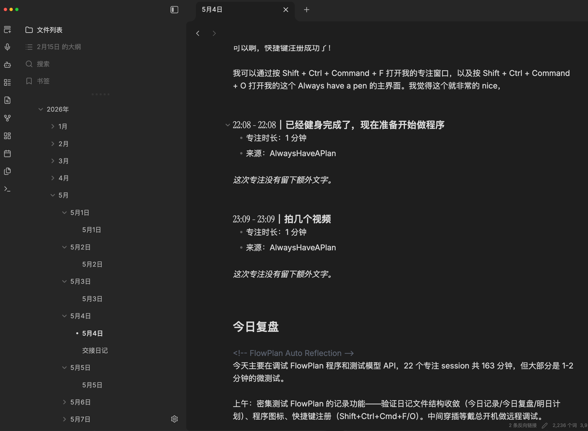

# AlwaysHaveAPlan

<p align="center">
  
</p>

## 价值

**AlwaysHaveAPlan** 是一款 macOS 14+ 原生应用：解锁或唤醒 Mac 时，它根据当前日历状态显示提醒；进入专注模式后，它提供全屏书写空间，并在关闭专注窗口时尝试把本次记录写入一个特定的 Obsidian 日记目录。

它的核心是把“现在要做什么”留在解锁后的第一眼，再把专注过程留下可回看的文字。不是云端日历服务，也不是通用的 Obsidian 同步工具。

## 真实界面

### 1. 解锁提醒


### 2. 进入专注


### 3. 写入 Obsidian 日记



这些是仓库内已有的真实截图；SVG 标题不替代或伪造应用界面。

## 机制与代码证据

- 应用使用 `NSWorkspace` 和 `DistributedNotificationCenter` 监听会话激活、屏幕唤醒及 `com.apple.screenIsUnlocked`，再检查当前日历事件。
- `CalendarManager` 通过 EventKit 请求日历完整访问权限；有权限时读取当前事件，也可在可写日历中创建计划事项。
- 专注模式默认从 25 分钟开始；关闭窗口时，`WindowManager` 将标题、文字和时长交给 `ObsidianDailyNoteService`。
- 日记服务查找固定的 iCloud Obsidian 路径 `Documents/Workshop/📓 睡前写-日记`，按 `年/月/日` 建立或更新 Markdown 日记。找不到该路径时只记录错误并跳过写入。
- `Control+Shift+Command+O` 打开主提示，`Control+Shift+Command+F` 进入专注模式；应用也会尝试注册为 macOS 登录项。

## 首次使用

### 安装

在 macOS 14 或更高版本上运行：

```sh
curl -fsSL https://raw.githubusercontent.com/tang730125633/alwayshaveaplan/main/install.sh | bash
```

安装脚本先尝试下载最新 GitHub Release 中的 DMG；若没有可用 DMG，则浅克隆源码、运行 `./build-release.sh`，并将 `AlwaysHaveAPlan.app` 复制到 `/Applications`。它会替换同名应用，执行前请确认这是你要安装的来源。

也可以从源码构建：

```sh
git clone https://github.com/tang730125633/alwayshaveaplan.git
cd alwayshaveaplan
./build-release.sh
cp -R run/release/AlwaysHaveAPlan.app /Applications/
open /Applications/AlwaysHaveAPlan.app
```

首次启动时，在系统提示中授予**日历完整访问权限**，应用才能读取当前日程和创建计划事项。若 Gatekeeper 拦截未签名构建，请在“系统设置 → 隐私与安全性”中按 macOS 提示处理，或在 Finder 中右键选择“打开”。

### 最短体验路径

1. 启动 `/Applications/AlwaysHaveAPlan.app` 并授予日历权限。
2. 在系统日历中创建一个正在进行的事件，或按 `Control+Command+Q` 锁屏后解锁。
3. 用 `Control+Shift+Command+F` 打开专注模式，输入任务和记录后关闭窗口。
4. 仅当本机存在上述固定 Obsidian 日记目录时，再检查当天 Markdown 文件是否出现记录。

## 发布、权限与隐私

推送 `v*` 标签会触发仓库内的 GitHub Actions 工作流，构建并发布 `AlwaysHaveAPlan.dmg`、`AlwaysHaveAPlan.zip` 和 `SHA256SUMS.txt`。当前公开的 [Releases](https://github.com/tang730125633/alwayshaveaplan/releases) 已提供这三类资产；安装前仍应以页面中的最新版本和校验文件为准。

日历权限的用途由应用的 `Info.plist` 声明为读取当前日程和创建计划事项。日记写入是本机文件操作，且路径目前写死在代码中；在使用前请确认该目录属于你、其中内容适合被应用写入，并理解专注记录会包含你输入的文字。

仓库内没有单独的 Swift 测试目标；最小构建检查是：

```sh
swift build
```

构建成功只能证明当前 Swift 包可编译，不能替代对日历授权、解锁事件、Gatekeeper、Release 资产或个人 Obsidian 路径的真实设备验证。

## 细节

- Swift 5.9 / SwiftUI，目标平台为 macOS 14。
- EventKit 管理日历；Carbon 注册全局快捷键；`NSVisualEffectView` 与 `Canvas` 支持玻璃和粒子视觉。
- 项目基于 [ChrisZou/alwayshaveaplan](https://github.com/ChrisZou/alwayshaveaplan) 扩展和重设计。
- 许可证： [MIT](LICENSE)。
